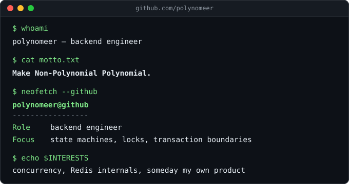

<!--
**Polynomeer/Polynomeer** is a ✨ _special_ ✨ repository because its `README.md` (this file) appears on your GitHub profile.
-->

  

  

  

> [!IMPORTANT]
> What I claim, I rebuild outside of work and put under load before I call it proven — see the projects below.

## `~/projects`

<code>parity-pay/</code> — prepaid wallet + ledger, 41 failure experiments, 14 defects fixed

 

Lost bank responses are kept as an undetermined state and settled by status query instead of retried. A Transactional Outbox bridges DB commit and Kafka publish. Broker kills, misconfigured partition keys, and slow institutions were reproduced to measure what bulkheads, circuit breakers, and rate limiters each prevent.

[repo](https://github.com/polynomeer/parity-pay) · [write-up](https://polynomeer.github.io/series/parity-pay/)

<code>monticker/</code> — event-centric stock monitor, TimescaleDB + OpenTelemetry

 

Volume surges judged as multiples of an EMA baseline. One record per change per minute, enforced by a pre-save check and a DB constraint.

[repo](https://github.com/polynomeer/monticker) · [write-up](https://polynomeer.github.io/series/monticker/)

<code>quno/</code> — revisioned Q&amp;A, row-locked concurrent edits

 

Concurrent edits lock the question row before computing the next version. The change and its notification request commit in one transaction — verified with an 8-thread integration test.

[repo](https://github.com/polynomeer/quno)

<code>sys-drill/</code> — failure-handling practice platform, AI-graded + server-verified

 

Six exercises graded by staged tests. Design answers are scored by an AI evaluator whose output the server validates and recomputes.

[repo](https://github.com/polynomeer/sys-drill)

<code>spring-lab/</code> — 20-week walk through Spring internals

 

Container, bean lifecycle, AOP, transactions, MVC, Boot auto-configuration — verified against source and reproduced in reduced modules with tests.

[repo](https://github.com/polynomeer/spring-lab)

<code>redis-lite-java/</code> — Redis clone on Java NIO

 

RESP protocol, single-threaded reactor, expiry heap, transactions, Pub/Sub, Lua.

[repo](https://github.com/polynomeer/redis-lite-java)

## GitHub status at a glance

<table>
  <tr>
    <td></td>
    <td></td>
  </tr>
</table>
